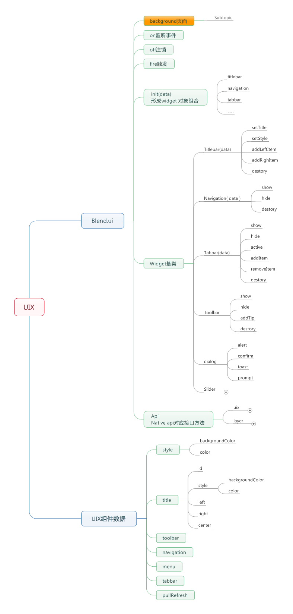

# Blend2

## blend2简介

为了让应用更快接入，提供了Blend2。 Blend2是现有最简单的接入百度框和直达号的方式。

Blend2 基于手机百度和轻工厂环境下的HTML5 转换为流畅的Native应用的

Blend2 提供 UI 和 Api两大功能：在UI上，提供应用页面间的流畅切换能力，下拉刷新，丰富的Native组件，相对于HTML5组件而言，响应更及时，体验更流畅。除此之外，开发者还能通过Blend2来调用Native API。是开发者轻松的使用Web开发技术在手机百度和轻工厂的环境下开发出一款媲美Native应用的产品。

## Blend2 API图示

## Blend2概述

<table>
	<thead>
		<tr><th>分组名称</th><th>API接口</th><th>功能说明</th></tr>
	</thead>
	<tbody>
		<tr>
			<td rowspan="6">Blend UI Widget</td>
			<td>Blend.ui.Titlebar</td>
			<td>页面titlebar</td>
		</tr>
		<tr>
			<td>Blend.ui.Toolbar</td>
			<td>页面底部导航组件</td>
		</tr>
		<tr>
			<td>Blend.ui.Tabbar</td>
			<td>页面Tab导航组件</td>
		</tr>
		<tr>
			<td>Blend.ui.Tab</td>
			<td>页面Tab导航</td>
		</tr>
		<tr>
			<td>Blend.ui.Sliderbar</td>
			<td>页面slider边栏导航组件</td>
		</tr>
		<tr>
			<td>Blend.ui.List</td>
			<td>页面List列表组件</td>
		</tr>

		<tr>
			<td rowspan="3">Blend UI Component</td>
			<td>Blend.ui.Gallery</td>
			<td>页面图片浏览组件</td>
		</tr>
		<tr>
			<td>Blend.ui.Dialog</td>
			<td>页面Dialog组件</td>
		</tr>
		<tr>
			<td>Blend.ui.finish</td>
			<td>销毁当前页面</td>
		</tr>

		<tr>
			<td rowspan="3">Blend2 事件机制</td>
			<td>Blend.ui.on</td>
			<td>事件绑定</td>
		</tr>
		<tr>
			<td>Blend.ui.off</td>
			<td>事件解绑</td>
		</tr>
		<tr>
			<td>Blend.ui.fire</td>
			<td>事件触发</td>
		</tr>
	
	</tbody>
</table>

## Blend2 API

### on

	Blend.ui.on(customEvent, handler);

添加事件监听

参数：

- customEvent: 自定义事件类型;
- handler: 事件监听器

### fire

	Blend.ui.fire(customEvent);

触发事件

参数：

- customEvent: 自定义事件类型;

### off

取消事件监听

	Blend.ui.off(customEvent, handler);

参数：

- customEvent: 自定义事件类型;
- handler: 事件监听器

### Widget

组件基类

	Blend.ui.Widget

**方法**

- render()
- setStyle(style)
- destory()

#### render
	
	render()

**功能描述**

渲染组件

**参数说明**

- 无

### TitleBar

顶部导航组件

**继承**：Widget

**方法**

- setTitle(text)
- addLeft()
- addRight()
- addCenter()

### TabBar、ToolBar

底部导航

**继承**：Widget

**方法**

- removeItem()
- addItem()
- active()

### Navigation

导航

**继承**：Widget

**方法**

- removeItem()
- addItem()

## 组件的创建

	Blend.ui.create(component, config);

组件创建工厂类
